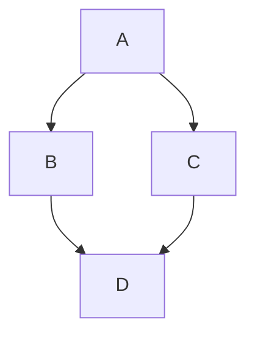

# Markdown 语法手册

## 目录

1. [Markdown 简介](#markdown-简介)
2. [基础语法](#基础语法)
3. [扩展语法](#扩展语法)
4. [HTML 支持](#html-支持)
5. [编辑器特殊语法](#编辑器特殊语法)
6. [最佳实践](#最佳实践)
7. [常见问题解答](#常见问题解答)

## Markdown 简介

Markdown 是一种轻量级标记语言，由 John Gruber 于 2004 年创建。它允许人们使用易读易写的纯文本格式编写文档，然后转换成有效的 HTML 文档。

### Markdown 的优势

- **易于学习**：语法简单直观，学习成本低
- **可读性强**：即使不转换为 HTML，原始文本也具有良好的可读性
- **跨平台**：几乎所有平台都支持 Markdown
- **专注内容**：让创作者专注于内容而非格式
- **广泛应用**：被广泛用于博客、文档、笔记、书籍、演示文稿等

## 基础语法

### 标题

Markdown 支持六级标题，使用 `#` 符号表示：

```markdown
# 一级标题
## 二级标题
### 三级标题
#### 四级标题
##### 五级标题
###### 六级标题
```

也可以使用下划线语法（仅支持一级和二级标题）：

```markdown
一级标题
=========

二级标题
---------
```

### 段落和换行

段落之间使用一个或多个空行分隔：

```markdown
这是第一段。

这是第二段。
```

在行末添加两个或更多空格，然后按回车键，可以实现换行：

```markdown
这是第一行。  
这是第二行。
```

### 强调

```markdown
*斜体文本* 或 _斜体文本_
**粗体文本** 或 __粗体文本__
***粗斜体文本*** 或 ___粗斜体文本___
~~删除线~~
```

效果：
- *斜体文本*
- **粗体文本**
- ***粗斜体文本***
- ~~删除线~~

### 列表

#### 无序列表

使用 `-`、`*` 或 `+` 创建无序列表：

```markdown
- 项目 1
- 项目 2
  - 子项目 2.1
  - 子项目 2.2
- 项目 3

* 项目 1
* 项目 2

+ 项目 1
+ 项目 2
```

#### 有序列表

使用数字加点创建有序列表：

```markdown
1. 第一项
2. 第二项
3. 第三项
   1. 子项 3.1
   2. 子项 3.2
```

### 链接

```markdown
[链接文本](URL "可选标题")
```

例如：

```markdown
[GitHub](https://github.com "GitHub 官网")
```

自动链接：

```markdown
<https://github.com>
<email@example.com>
```

### 图片

```markdown

```

例如：

```markdown

```

### 引用

使用 `>` 符号创建引用：

```markdown
> 这是一个引用。
> 
> 这是引用的第二段。
>
> > 这是嵌套引用。
```

### 水平线

使用三个或更多的 `-`、`*` 或 `_` 创建水平线：

```markdown
---
***
___
```

### 代码

行内代码使用反引号 `` ` `` 包裹：

```markdown
使用 `print("Hello World")` 输出文本。
```

代码块使用三个反引号或缩进四个空格：

````markdown
```
function hello() {
  console.log("Hello World");
}
```
````

或者：

```markdown
    function hello() {
      console.log("Hello World");
    }
```

### 转义字符

使用反斜杠 `\` 转义特殊字符：

```markdown
\* 这不是斜体 \*
```

可以转义的字符：

```
\ 反斜杠
` 反引号
* 星号
_ 下划线
{} 花括号
[] 方括号
() 小括号
# 井号
+ 加号
- 减号/连字符
. 点
! 感叹号
```

## 扩展语法

不同的 Markdown 处理器支持不同的扩展语法。以下是一些常见的扩展语法。

### 表格

```markdown
| 表头 1 | 表头 2 | 表头 3 |
| ------ | ------ | ------ |
| 单元格 1 | 单元格 2 | 单元格 3 |
| 单元格 4 | 单元格 5 | 单元格 6 |
```

对齐方式：

```markdown
| 左对齐 | 居中对齐 | 右对齐 |
| :----- | :------: | -----: |
| 文本 | 文本 | 文本 |
```

### 脚注

```markdown
这里有一个脚注[^1]。

[^1]: 这是脚注的内容。
```

### 任务列表

```markdown
- [x] 已完成任务
- [ ] 未完成任务
- [ ] ~~取消的任务~~
```

### 定义列表

```markdown
术语 1
: 定义 1

术语 2
: 定义 2a
: 定义 2b
```

### 围栏代码块与语法高亮

````markdown
```javascript
function hello() {
  console.log("Hello World");
}
```
````

### 目录

一些 Markdown 处理器支持自动生成目录：

```markdown
[TOC]
```

或者：

```markdown
[[toc]]
```

### 数学公式

许多 Markdown 编辑器支持 LaTeX 数学公式：

```markdown
行内公式：$E=mc^2$

块级公式：

$$
E=mc^2
$$
```

### 上标和下标

```markdown
上标：X^2^
下标：H~2~O
```

### 高亮

```markdown
==高亮文本==
```

## HTML 支持

Markdown 允许嵌入 HTML 代码：

```markdown
<div style="color: red;">
  这是一段红色文本。
</div>

<table>
  <tr>
    <td>单元格 1</td>
    <td>单元格 2</td>
  </tr>
</table>
```

### 常用 HTML 标签

```markdown
<kbd>Ctrl</kbd> + <kbd>C</kbd> 复制文本

<mark>高亮文本</mark>

<u>下划线文本</u>

<small>小号文本</small>

<details>
  <summary>点击展开</summary>
  这里是详细内容。
</details>
```

## 编辑器特殊语法

不同的 Markdown 编辑器和平台可能支持特殊的语法扩展。

### GitHub Flavored Markdown (GFM)

#### 自动链接

GitHub 会自动将 URL 转换为链接：

```markdown
https://github.com
```

#### 表情符号

```markdown
:smile: :heart: :thumbsup:
```

#### 提及用户和团队

```markdown
@username
@organization/team
```

#### 引用 Issue 和 Pull Request

```markdown
#123
username/repository#123
```

### Typora 特殊语法

#### 图表支持

````markdown

````

#### 目录

```markdown
[toc]
```

### Obsidian 特殊语法

#### 内部链接

```markdown
[[笔记名称]]
[[笔记名称|显示文本]]
```

#### 嵌入内容

```markdown
![[笔记名称]]
![[图片.png]]
```

## 最佳实践

### 文档结构

1. **使用标题层次**：合理使用标题层次结构，不要跳级
2. **添加目录**：长文档添加目录便于导航
3. **分段合理**：每段表达一个完整的思想
4. **使用列表**：使用列表组织相关信息

### 格式规范

1. **一致性**：保持格式一致性
2. **空行使用**：使用空行分隔段落和块级元素
3. **代码格式化**：代码块指定语言以获得语法高亮
4. **链接文本**：使用描述性的链接文本

### 图片处理

1. **添加替代文本**：为图片添加有意义的替代文本
2. **控制图片大小**：在支持的编辑器中控制图片大小
3. **图片存储**：考虑图片的存储位置和引用方式

### 版本控制

1. **使用 Git**：使用 Git 管理 Markdown 文档
2. **原子提交**：每次提交解决一个问题
3. **有意义的提交信息**：编写清晰的提交信息

## 常见问题解答

### 如何在 Markdown 中插入换行？

在行末添加两个或更多空格，然后按回车键，可以实现换行。或者使用 HTML 的 `<br>` 标签。

### 如何在 Markdown 中插入特殊字符？

使用反斜杠 `\` 转义特殊字符，或者使用 HTML 实体。

### 不同 Markdown 处理器的语法有什么区别？

Markdown 有多种实现，如 CommonMark、GitHub Flavored Markdown、Pandoc 等，它们在扩展语法上可能有所不同。建议查阅特定处理器的文档。

### 如何在 Markdown 中创建可点击的目录？

手动创建锚点链接，或使用支持自动生成目录的 Markdown 处理器。

### 如何在 Markdown 中对齐文本？

Markdown 原生不支持文本对齐，但可以使用 HTML 标签和 CSS 样式实现。

```markdown
<div style="text-align: center">居中文本</div>
<div style="text-align: right">右对齐文本</div>
```

### 如何在 Markdown 中插入视频？

Markdown 原生不支持视频嵌入，但可以使用 HTML 标签：

```markdown
<video src="video.mp4" controls></video>

<iframe width="560" height="315" src="https://www.youtube.com/embed/VIDEO_ID" frameborder="0" allowfullscreen></iframe>
```

---

本手册涵盖了 Markdown 的基础和进阶用法，希望能帮助你更好地使用 Markdown 进行写作。如有更多问题，可以参考 [Markdown 官方文档](https://daringfireball.net/projects/markdown/) 或各平台的具体实现文档。